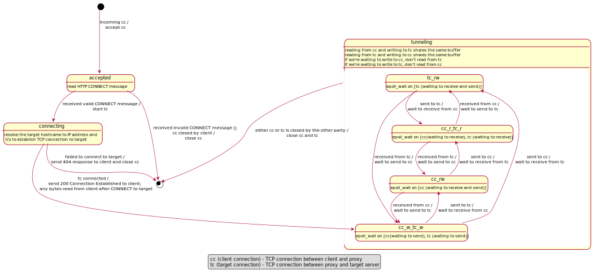

# Transparent HTTPS Proxy

## Setup

1. Compile the source code

```
make build
```

The executable will be in `./out` directory.

2. Start the proxy

```
./out/proxy <port> <flag_telemetry> <path to blacklist file> [thread count]
```

For example, to start the proxy with the following configurations,

- listening on port 3000
- with telemetry enabled
- a blacklist file with name 'blacklist.txt' in `./out` directory
- 8 threads are used

run `./out/proxy 3000 1 out/blacklist.txt 8`

Note: The default number of threads is 8 if `thread count` is not specified. At least 2 threads are required (the reason
for this is explained later).

3. Connect to SoC VPN (because `xcne1` and `xcne2` are not publicly accessible)

4. Configure the FireFox settings according to the instructions given in the project doc. Use the IP address of `xcne1`
   or `xcne2` (where you're running the proxy) and the port number you have specified when starting the proxy.

6. Start browsing!

## Design

### Multiplexed, Non-blocking Network IO

Being the proxy, we need to read from both ends and send any data we receive from one end to the other end.

If we have read all the data from a sender, subsequent attempts to read more bytes from the socket will block the
current thread until more data arrives. Similarly, if we send data to a receiver, and the receiver's TCP buffer fills
up, subsequent attempts to send more bytes will block until the remote buffer has space again.

If a thread is blocked for IO, it cannot process other connections until the IO completes. This stalls all the pending
requests that are yet to be served. We could work around this by creating a new thread for each blocking operation
However, this approach would not scale well when we have many connections open.

Try loading https://www.reddit.com and see how many HTTP requests it makes. On my machine it makes 150 (!) requests in
the first 10 seconds of loading the page, without any user interaction. If each request is served on a new thread, we
would create 150 new threads just to serve the homepage of a single website.

It should be obvious that proxying network traffic is inherently an IO-bound task. The performance of the proxy heavily
depends on how we handle IO in a scalable manner. To do this, we must abandon the blocking and synchronous programming
paradigm and adopt signal-driven or asynchronous IO.

Various operating systems provide tools for us to do this. The Linux kernel provides `select`, `poll`, and `epoll`, all
of which are mechanisms for us to monitor a set of file descriptors to see if IO is possible on any of them. We inform
the kernel what we would like to do with each file descriptor (read or write), and block until at least one of the file
descriptors is available for the operation we requested for. Once the kernel reports that a file descriptor is ready, we
know for sure that a subsequent IO will not block.

- `select` can monitor up to `FD_SETSIZE` number of file descriptors at a time, typically a small number (e.g., 1024).
- `poll` doesn't have a fixed limit of descriptors it can monitor at a time, but requires us to perform a linear scan of
  all the passed descriptors every time to check readiness notification, which is `O(n)` and slow.
- `epoll` is meant to replace the older POSIX `select` and `poll` system calls to achieve better performance in more
  demanding applications, where the number of watched file descriptors is large. It has no such fixed limits, and does
  not perform any linear scans. However, it is Linux specific.

In our implementation, we use `epoll` to perform IO multiplexing. When we need to perform IO on a socket, we don't do it
directly. Instead, we add it to our `epoll` instance and watch it for IO readiness. Only after `epoll` notifies us that
he socket is ready do we perform the IO. Meanwhile, we can service other sockets that are ready. This allows each thread
to handle many connections concurrently even on a single thread.

### Asynchronous DNS resolution

The typical way to perform DNS resolution in C is to call the `getaddrinfo` library function. Unfortunately, this is a
blocking call. In some cases, we observed `getaddrinfo` to block the calling thread for up to 6 seconds when looking up
a domain name that is probably not in the DNS cache. This stalls all the pending tasks on the current thread, including
the data forwarding using `epoll`, producing very user-noticeable delays in other connections handled by the same thread
as well.

To solve this problem, we use a small external library `asyncaddrinfo` (link below) which wraps the
blocking `getaddrinfo` call in an asynchronous API. Internally, it uses a configurable number of worker threads to
call `getaddrinfo` and gives us a file descriptor to receive the call result.

We can conveniently add the file descriptor into our epoll instance and wait for its readability. This allows the thread
to keep on serving other requests while `getaddrinfo` is being called concurrently.

We allocate 25% of our threads to `asyncaddrinfo`, i.e., if we run with 8 threads, then 2 threads will be
for `asyncaddrinfo`. At least one thread must be allocated to `asyncaddrinfo`. This is the reason why the proxy needs at
least 2 threads (the other thread is to run an `epoll` instance and handle IO on sockets).

### Multithreading and Synchronization

On program start, the proxy will create a listening socket and listen on the designated port for incoming connections.
It will then spawn a number of threads, some of which are for `asyncaddrinfo`, and the rest (including the main thread)
are for handling proxy connections and socket IO.

Each connection thread runs its own `epoll` instance and the listening socket is added to each instance. When incoming
connections arrive, all the connection threads will be notified of the socket's readability, and attempt to accept the
connection. However, each connection will only be accepted once by kernel guarantees.

The thread that accepted the connection will then be responsible for the lifetime of the connection. All the subsequent
operations performed on the connection will be done by this thread. More specifically, the thread will only add the
connection socket to its own `epoll` instance and no one else's. When the socket is ready for IO, this thread will be
the only thread to receive the notification. As a result, there will be no race conditions and no additional
synchronisation for the connection are needed.

### Lifecycle of a Connection

As explained above, all the threads will monitor the listening socket for incoming connections.

An accepted connection socket can go through a few states, as shown in the state transition diagram below.



```c
// `handle_connections_in_event_loop`
struct epoll_event event;
// Configure `event.data.ptr` to be NULL when there are events on listening socket
event.data.ptr = NULL;
// Since we will call `accept4` until there are no more incoming connections,
// and edge-triggered is more efficient than level-triggered,
// we can register edge-triggered notification for read events on the listening socket
event.events = EPOLLIN | EPOLLET;

epoll_ctl(epoll_fd, EPOLL_CTL_ADD, listening_socket, &event) 
```  

3. Once an incoming connections is accepted, add the client socket to the handling thread's `epoll` instance and wait
   for the HTTP CONNECT message from the client socket.

```c
// `accept_incoming_connections`
struct epoll_accepted_cb* cb = malloc(sizeof(struct epoll_accepted_cb));
cb->type = cb_type_accepted;
cb->conn = conn;

struct epoll_event event;
event.events = EPOLLIN | EPOLLONESHOT;
event.data.ptr = cb;

epoll_ctl(epoll_fd, EPOLL_CTL_ADD, client_socket, &event)
```

3. When the client socket is available for reading, parse the HTTP CONNECT message.

- If the message is incomplete, read the existing fragment into the buffer and continue waiting for more data to be read
  from the client socket by registering read event of the client socket into the `epoll` instance.

```c
// `handle_accepted_cb`
struct epoll_event event;
event.events = EPOLLIN | EPOLLONESHOT;
event.data.ptr = cb;

epoll_ctl(epoll_fd, EPOLL_CTL_MOD, conn->client_socket, &event)
```

- If the message is well formed and complete, start hostname lookup at the DNS thread.

```c
struct epoll_connecting_cb* cb = malloc(sizeof(struct epoll_connecting_cb));
cb->type = cb_type_connecting;
cb->conn = conn;
cb->failed = false;

struct epoll_event event;
event.events = EPOLLIN | EPOLLONESHOT;
event.data.ptr = cb;

epoll_ctl(epoll_fd, EPOLL_CTL_ADD, cb->asyncaddrinfo_fd, &event)
```

- If the message is malformed, close the connection.

4. When the asyncaddrinfo lookup result is available, initialize target socket and connect to the target.

```c
struct epoll_event event;
event.events = EPOLLOUT | EPOLLONESHOT;
event.data.ptr = cb;

epoll_ctl(epoll_fd, EPOLL_CTL_ADD, cb->target_sock, &event)  
```

- If DNS resolution or connection fails, send HTTP 4xx to client.

5. When the connection is completed, send HTTP 200 to client and start the tunnelling.

- Send HTTP 200 to client

```c
- epoll_ctl(epoll_fd, EPOLL_CTL_ADD, client_write_fd, &event)  
    -> EPOLLOUT | EPOLLONESHOT  
    -> event.data.ptr = cb  
        -> cb->type = cb_type_tunneling;  
        -> cb->conn = conn;  
        -> cb->is_to_target = false;  
        -> cb->is_read = false;  
```

- If there is more to write to target, wait for target socket to become available for writing

```c
- epoll_ctl(epoll_fd, EPOLL_CTL_MOD, target_write_fd, &event) 
    -> EPOLLOUT | EPOLLONESHOT  
    -> event.data.ptr = cb  
        -> cb->type = cb_type_tunneling;  
        -> cb->conn = conn;  
        -> cb->is_to_target = true;  
        -> cb->is_read = false; 
``` 

- If there is nothing left to write to target, wait for client socket to become available for reading

```c
- epoll_ctl(epoll_fd, EPOLL_CTL_MOD, client_read_fd, &event)  
    -> EPOLLIN | EPOLLONESHOT  
    -> event.data.ptr = cb  
        -> cb->type = cb_type_tunneling;  
        -> cb->conn = conn;  
        -> cb->is_to_target = true;  
        -> cb->is_read = true;  
``` 

6. Once the tunnelling is setup, the following four events forms the event loop and our proxy serves as the relay agent
   to relay requests/response between client and server.

- Client socket becomes available to read (i.e. client sends a request to server), read the data from the client socket
  into the client_to_target buffer, wait for the target socket to become available for writing so we can send the
  request to the server.

- Target socket becomes available to write (i.e. we can now relay the request from client to server), write the data in
  client_to_target buffer to the target socket, wait for the target socket to become available for reading so we can
  read the response from the server.

- Target socket becomes available to read (i.e. server replies to client), read the data from the target socket into the
  target_to_client buffer, wait for the client socket to become available for writing so we can send the response to the
  client.

- Client socket becomes available to write (i.e. we can now relay data from server to client), write the data in
  target_to_client buffer to the client socket, now wait for the client socket to become available for reading again (
  i.e. wait for next request)

<!-- ```
struct tunnel_conn {
  // file descriptors
  int client_socket; (set in step 2) // read
  int client_socket_dup; (set in step 5) // write
  int target_socket; (set in step 4) // read
  int target_socket_dup; (set in step 5) // write

  // textual representations of ip/hostname:port for printing
  char* client_hostport; (set in step 2)
  char* target_hostport; (set in step 4)

  // obtained from the CONNECT HTTP message
  char* target_host; (set in step 3)
  char* target_port; (set in step 3)
  char* http_version; (set in step 3)

  // buffers for tunneling
  struct tunnel_buffer to_target_buffer; (set in step 2)
  struct tunnel_buffer to_client_buffer; (set in step 2)

  // how many directions of this connection have been closed (0, 1, or 2)
  int halves_closed;

  // telemetry
  bool telemetry_enabled; (set in step 2)
  struct timespec started_at; (set in step 2)
  unsigned long long n_bytes_streamed;
};
``` -->

## External Libraries Used

### asyncaddrinfo

- Repository: https://github.com/firestuff/asyncaddrinfo
- Source included under `lib/asyncaddrinfo`
- BSD License

## References

- https://en.cppreference.com/w/c
- https://stackoverflow.com/
- [How to use epoll? - a complete example in C](https://web.archive.org/web/20170427121729/https://banu.com/blog/2/how-to-use-epoll-a-complete-example-in-c/)
- [RFC 7231 Section 4.3.6 CONNECT](https://httpwg.org/specs/rfc7231.html#rfc.section.4.3.6)
- Linux manual pages (e.g., `man socket`, etc)