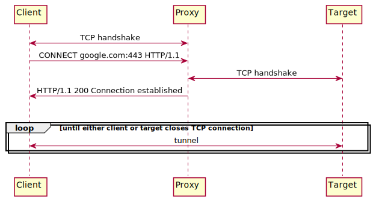

# Transparent HTTPS Proxy

This is a transparent HTTPS proxy written using Linux `epoll`.

## How It Works



To initiate an HTTP request, the client sends a
[HTTP `CONNECT`](https://httpwg.org/specs/rfc7231.html#rfc.section.4.3.6) request to the proxy indicating the target
server to connect to. Upon receiving this request, the proxy looks up the IP address of the target server and
establishes a TCP connection with the target server.

Once established, the proxy sends a `200 Connection established` response to the client. Subsequently, the proxy acts as
an opaque, full-duplex TCP tunnel between a client and a target server and relays any data sent in either direction.
Since it only speaks TCP and does not understand TLS/HTTP, it will not be able to decrypt the TLS traffic or modify the
HTTP message.

When either the client or the target server closes the connection, the proxy also closes the connection with the other
end.

## Extensions

### Statistics

If this optional feature is enabled, the proxy will print the number of bytes transferred and duration of each TCP
connection.

### Blocklist

If a blocklist is provided, the proxy will reject any connections based on rules specified in the blocklist. Each line
in the blocklist specifies a string. Any domain name that contains any of the blocked strings will be blocked.

For example, the following blocklist will block connections to 'google.com', 'google.com.au', 'facebook.com', '
graph.facebook.com', etc.

```
google
facebook
```

## Compile The Source Code

Requires GCC and `make`.

```bash
make
```

The executable will be in `./out` directory.

## Usage

```bash
./out/proxy port enable_stats path_to_blocklist [thread_count]
```

For example, to start the proxy with the following configurations,

- listen on port 3000
- enable stats
- use a blocklist file with name `blocklist.txt` in `./out` directory
- use 8 threads

run `./out/proxy 3000 1 out/blocklist.txt 8`

Note: The default number of threads is 8 if `thread_count` is not specified. At least 2 threads are required (the reason
for this is explained later).

## Design

### Efficient Network IO with `epoll`

<details>
<summary>Why blocking IO is not an option</summary>

The proxy needs to read from both ends and send any data we receive from one end to the other end.

If we have read all the data from a sender, subsequent attempts to read more bytes from the socket will block the
current thread until more data arrives. Similarly, if we send data to a receiver, and the receiver's TCP buffer fills
up, subsequent attempts to send more bytes will block until the remote buffer has space again.

If a thread is blocked for IO, it cannot process other connections until the IO completes. This stalls all the pending
requests that are yet to be served.

One way to work around this issue is to create a new thread for each blocking operation. However, this approach would
not scale well when we have many connections open.

Try loading https://www.reddit.com and see how many HTTP requests it makes. On my machine it makes 150 (!) requests in
the first 10 seconds of loading the page, without any user interaction. If each request is served on a new thread, we
would create 150 new threads just to serve the homepage of a single website.
</details>

Proxying network traffic is inherently an IO-bound task. The performance of the proxy heavily depends on how we handle
IO in a scalable manner. To do this, we must abandon the blocking and synchronous programming paradigm and adopt
event-driven, asynchronous IO. With event-driven IO, instead of calling `read()` and `write()` directly (which risks
blocking the current thread), we register the file descriptor we would like to read or write and receive a notification
when the file descriptor becomes available.

Different operating systems provide different tools for the job. The Linux kernel provides `select`, `poll`, and `epoll`
, all of which are mechanisms for us to monitor a set of file descriptors and receive a notification when any of them
becomes available.

- `select` only informs the user when _some_ file descriptor is ready for IO and does not tell us which one. We need to
  scan all the monitored file descriptors to find out which ones are actually ready. Furthermore, it can only monitor up
  to `FD_SETSIZE` (typically 1024) of file descriptors at a time.
- `poll` doesn't have a fixed limit of descriptors it can monitor at a time, but still requires us to do a linear scan
  of all monitored file descriptors.
- `epoll` is meant to replace the older POSIX `select` and `poll` system calls to achieve better performance in more
  demanding applications, where the number of watched file descriptors is large. It has no fixed limits to number of
  watched file descriptors, and will helpfully report which file descriptors among all those watched are ready. However,
  it is Linux specific.

In our implementation, we use `epoll` to perform IO multiplexing. When we need to perform IO on a socket, we don't
call `read` or `write` directly. Instead, we add it to our `epoll` instance and watch it for IO readiness. Only
after `epoll` notifies us that the socket is ready do we perform the IO. Meanwhile, we can service other sockets that
are ready. This allows each thread to handle many connections concurrently even on a single thread.

### Asynchronous DNS resolution

The typical way to perform DNS resolution in C is to call the `getaddrinfo` library function. Unfortunately, this is a
blocking call. In some cases, we observed `getaddrinfo` to block the calling thread for up to 6 seconds when looking up
a domain name that is probably not in the DNS cache. This stalls all the pending tasks on the current thread, including
the data forwarding using `epoll`, producing very user-noticeable delays.

To solve this problem, we use a small external library `asyncaddrinfo` (link below) which wraps the
blocking `getaddrinfo` call in an asynchronous API. Internally, it uses a configurable number of worker threads to
call `getaddrinfo` and gives us a file descriptor to receive the call result.

We can conveniently add the file descriptor into our `epoll` instance and wait for its readability. This allows the
thread to keep on serving other requests while `getaddrinfo` is being called concurrently.

We allocate 25% of our threads to `asyncaddrinfo`, i.e., if we run with 8 threads, then 2 threads will be
for `asyncaddrinfo`. At least one thread must be allocated to `asyncaddrinfo`. This is the reason why the proxy needs at
least 2 threads (the other thread is to run an `epoll` instance and handle IO on sockets).

### Multithreading and Synchronization

Once a connection is accepted from the client on a thread, that thread is responsible for the lifetime of the
connection. As a result, there will be no race conditions and no additional synchronisation mechanisms are needed.

## External Libraries Used

### asyncaddrinfo

- Repository: https://github.com/firestuff/asyncaddrinfo
- Source included under `lib/asyncaddrinfo`
- BSD License

## References

- https://en.cppreference.com/w/c
- https://stackoverflow.com/
- [How to use epoll? - a complete example in C](https://web.archive.org/web/20170427121729/https://banu.com/blog/2/how-to-use-epoll-a-complete-example-in-c/)
- [RFC 7231 Section 4.3.6 CONNECT](https://httpwg.org/specs/rfc7231.html#rfc.section.4.3.6)
- Linux manual pages (e.g., `man socket`, etc)
